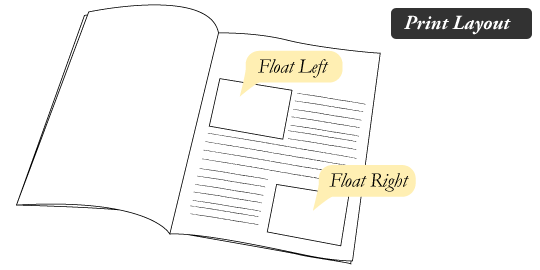
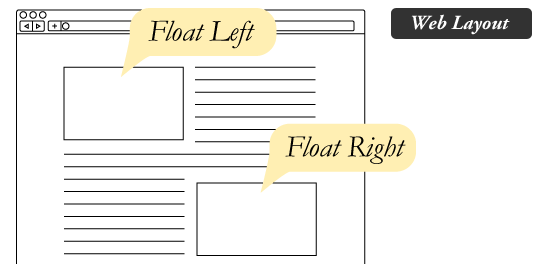

# RWD 
## whats is Responsive Web Design

Responsive web design is the practice of building a website suitable to work on every device and every screen size, no matter how large or small

## Responsive vs. Adaptive vs. Mobile

Responsive and adaptive web design are closely related,
- Responsive generally means to react quickly and positively to any change,
- adaptive means to be easily modified for a new purpose or situation, such as change
- Mobile, on the other hand, generally means to build a separate website commonly on a new domain solely for mobile users.

## Responsive web design is broken down into three main components, including flexible layouts, media queries, and flexible media

- flexible layouts: 

is the practice of building the layout of a website with a flexible grid, capable of dynamically resizing to any width. Flexible grids are built using relative length units, most commonly percentages or em units

- Media queries:

 were built as an extension to media types commonly found when targeting and including styles. Media queries provide the ability to specify different styles for individual browser and device circumstances, the width of the viewport or device orientation for example. Being able to apply uniquely targeted styles opens up a world of opportunity and leverage to responsive web design.

- Mobile First:

One popular technique with using media queries is called mobile first. The mobile first approach includes using styles targeted at smaller viewports as the default styles for a website, then use media queries to add styles as the viewport grows.
The operating belief behind mobile first design is that a user on a mobile device, commonly using a smaller viewport, shouldn’t have to load the styles for a desktop computer only to have them over written with mobile styles later. Doing so is a waste of bandwidth. Bandwidth that is precious to any users looking for a snappy website.

- Flexible Media:

The final, equally important aspect to responsive web design involves flexible media. As viewports begin to change size media doesn’t always follow suit. Images, videos, and other media types need to be scalable, changing their size as the size of the viewport changes.

# Float

Float is a CSS positioning property. To understand its purpose and origin, we can look to print design. In a print layout, images may be set into the page such that text wraps around them as needed. This is commonly and appropriately called “text wrap”. Here is an example of that.

In page layout programs, the boxes that hold the text can be told to honor the text wrap, or to ignore it. Ignoring the text wrap will allow the words to flow right over the image like it wasn’t even there. This is the difference between that image being part of the flow of the page (or not). Web design is very similar.

## What are floats used for?

floats can be used to create entire web layouts.
Floats are also helpful for layout in smaller instances.

