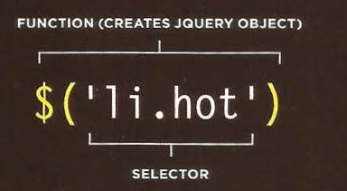
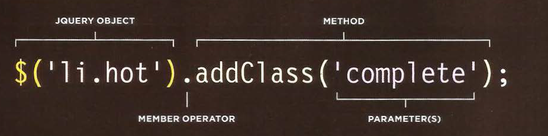
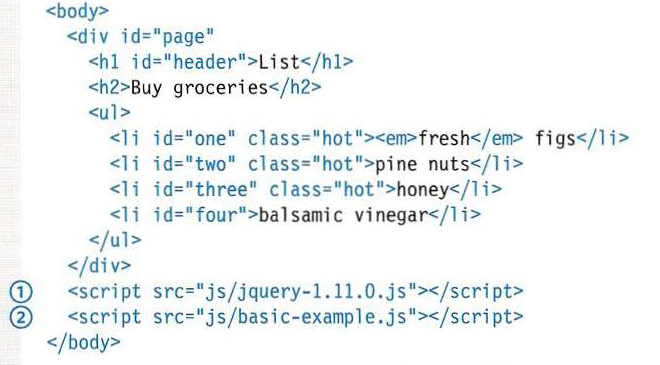
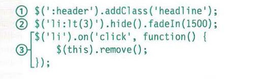
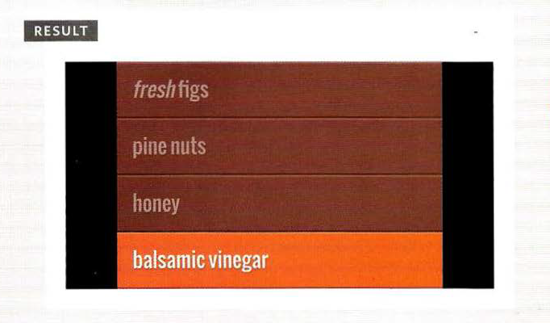
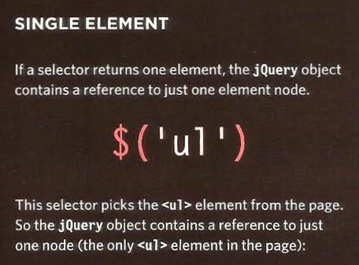
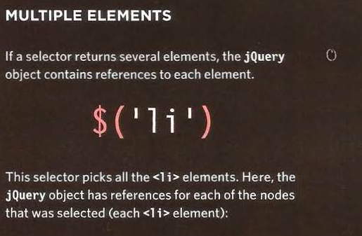
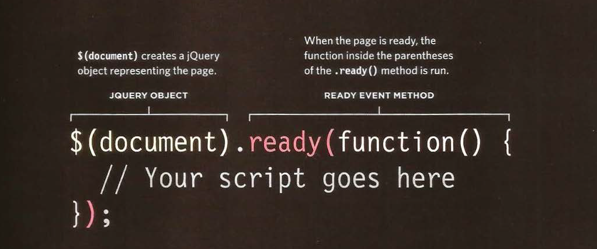

# JQUERY

## what is JQUERY?
jQuery is a JavaScript file that you include in your web pages. 
It lets you find elements using CSS-style selectors and then do something with the elements using jQuery methods.

* find elements:

A function called jQuery ``()`` lets you find one or more elements in the page.  It creates an object called jQuery which holds references to those elements.
 ``$()`` is often used as a shorthand to 
save typing jQuery ``( )``  , as shown here.

## jQuery methods

The jQuery object has many methods that you can use to work with the elements you select. The methods represent tasks that you commonly need to perform with elements.

- jQuery object is created by the jQuery() function. The object and the elements it contains 
is referred to as a matched set or a jQuery selection .

- Youcan then use the methods of the jQuery object to update the elements that it contains. Here, the 
method adds a new value to the cl ass attribute.

- The member operator indicates that the method on the right should be used to update the elements in 
the j Quer y object on the left.

- Each method has parameter(s) that provide details about how to update the elements. This parameter 
specifies a value to add to the c1ass attribute.

## A BASIC JQUERY EXAMPLE

in html page 

in java script page

the result 

## why we use jQuery ?

jQuery doesn't do anything you cannot achieve with pure JavaScript.
It is just a JavaScript file but estimates show it has been used on over a
quarter of the sites on the web, because it makes coding simpler.

jQuery's motto is "Write less, do more," because it allows you to achieve
the same goals but in fewer lines of code than you would need to write
with plain JavaScript.

## A MATCHED SET/JQUERY SELECTION

When you select one or more elements, a j Query object is returned.
It is also known as a matched set or a jquery selection.

  

## JQUERY METHODS  THAT GET AND  SET DATA

Some jQuery methods both retrieve information from, and update the contents of, elements.  But they 
do not always apply to all elements.

GET IN FORMATION

* If a jQuery selection holds more than one element, and a method is used to get information from the 
selected elements, it will retrieve information from only the first element in the matched set.

SET INFORMATION

* If a jQuery selection holds more than one element, and a methodis used to update information on
the page, it will update all of the elements in the
matched set, not just the first one.

## JQUERY OBJECTS STORE REFERENCES  TO ELEMENTS

When you create a selection with jQuery, it stores a reference to the corresponding nodes in the 
DOM tree. It does not create copies of them.

## CACHING JQUERY SELECTIONS IN VARIABLES

A jQuery object stores references to elements.
Caching a jQuery object stores a reference to it in a variable.

To create a jQuery object takes time, processing resources, and memory. The interpreter must:

1. Find the matchingnodes in the DOM tree
2. Create the jQuery object
3. Store references to the nodes in the jQuery object

So. if the  code needs to use the same selection more than once, it is better to use that same 
jQuery object again rather than repeat the above process. To do this, you storea referenceto the 
jQuery object in a variable.

## CHECKING  A PAGE IS READY  TO WORK WITH

jQuery's•  ready () method checks that the page is ready for your code to work with.

## the load event vs .ready method vs placing scripts before the closing ``</body>`` tag

|THE Load EVENT|THE .ready() METHOD|PLACING SCRIPT BEFORE THE CLOSING ``</BODY>`` TAG|
| ----------- | ----------- | ----------- |       
|jQuery had a•  1oad()  method. It fired on the 1oad event, but has been replaced by the•  on() .
As you saw on p272, the load
event fires after the page and all of its resources (images, CSS, and scripts) have loaded.

You should use this when your script relies on assets to have loaded, e.,g.  if it needs to know 
the dimensions of an image.

It works in all browsers, and also provides function -level scope  for the variables it contains.
)|
|jQuery's . ready() method checks if the browser supports the OOMContentloadedevent, because it 
fires as soon as the DOM has loaded (it does not wait for other assets to finish loading) and can 
make the page appear as if it is loading faster.

lfDOMContentloadedis supported, jQuery creates an event listener that responds to that event. But 
the event is only supported in modern browsers. In older browsers, jQuery will wait for the load 
event to fire.
|
|When you place your script at the end of the page (before the closing</body> tag), the HTML will 
have loaded into the DOM before the script runs.

You wi ll, however, stillsee people using the . ready() method because scripts that useit will 
still work if someone moves the script tag elsewhere in the HTML page. (This is particularly common 
when that script is being made available for other people to use.)
|
