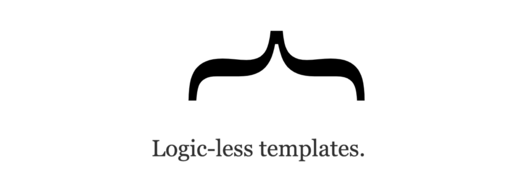

# Javascript Templating

### Javascript templating is a fast and efficient technique to render client-side view templates with Javascript by using a JSON data source. The template is HTML markup, with added templating tags that will either insert variables or run programming logic.

## Mustache

Mustache is a logic-less template syntax. It can be used for HTML, config files, source code — anything. It works by expanding tags in a template using values provided in a hash or object.

## Flexbox

Before the Flexbox Layout module, there were four layout modes:

* Block, for sections in a webpage
* Inline, for text
* Table, for two-dimensional table data
* Positioned, for explicit position of an element

The Flexible Box Layout Module, makes it easier to design flexible responsive layout structure without using float or positioning.

## Flex container

* display

This defines a flex container; inline or block depending on the given value. It enables a flex context for all its direct children.

* flex-direction

This establishes the main-axis, thus defining the direction flex items are placed in the flex container. Flexbox is (aside from optional wrapping) a single-direction layout concept. Think of flex items as primarily laying out either in horizontal rows or vertical columns

* flex-wrap

By default, flex items will all try to fit onto one line. You can change that and allow the items to wrap as needed with this property.

* flex-flow

This is a shorthand for the flex-direction and flex-wrap properties, which together define the flex container’s main and cross axes. The default value is row nowrap.

* justify-content

This defines the alignment along the main axis. It helps distribute extra free space leftover when either all the flex items on a line are inflexible, or are flexible but have reached their maximum size. It also exerts some control over the alignment of items when they overflow the line.

* align-items

This defines the default behavior for how flex items are laid out along the cross axis on the current line. Think of it as the justify-content version for the cross-axis (perpendicular to the main-axis)

* align-content

This aligns a flex container’s lines within when there is extra space in the cross-axis, similar to how justify-content aligns individual items within the main-axis.

Note: this property has no effect when there is only one line of flex items.

## Flex item

* order

By default, flex items are laid out in the source order. However, the order property controls the order in which they appear in the flex container.

* flex-grow

This defines the ability for a flex item to grow if necessary. It accepts a unitless value that serves as a proportion. It dictates what amount of the available space inside the flex container the item should take up

* flex-shrink

This defines the ability for a flex item to shrink if necessary.

* flex-basis

This defines the default size of an element before the remaining space is distributed.

* flex

This is the shorthand for flex-grow, flex-shrink and flex-basis combined. The second and third parameters (flex-shrink and flex-basis) are optional. The default is 0 1 auto, but if you set it with a single number value, it’s like 1 0.

* align-self

This allows the default alignment (or the one specified by align-items) to be overridden for individual flex items.