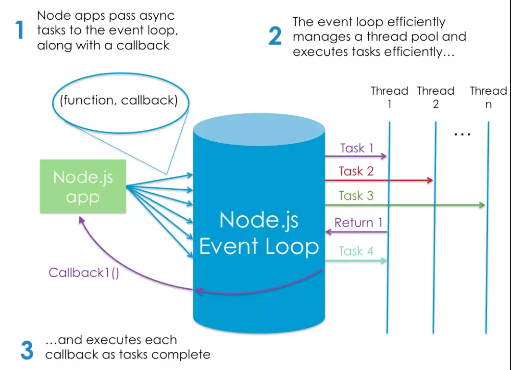

# Node.js

As an asynchronous event-driven JavaScript runtime, Node.js is designed to build scalable network applications. many connections can be handled concurrently. Upon each connection, the callback is fired, but if there is no work to be done, Node.js will sleep.

## Node Is Built on Google Chrome’s V8 JavaScript Engine

The V8 engine is the open-source JavaScript engine that runs in Google Chrome and other Chromium-based web browsers, including Brave, Opera, and Vivaldi. It was designed with performance in mind and is responsible for compiling JavaScript directly to native machine code that your computer can execute.

## instal node

to install a package globally follow these steps :

- type in your terminal “npm install -g jshint”.
- jshint index.js

to install a package locally follow these steps :
- “npm init -y”.
- “npm install lodash –save”.
- run “node (file name)”.
Node.js Used For developing a modern JavaScript application. node.js is a event-driven , also it is a single-threaded.

## how Node.js work?

