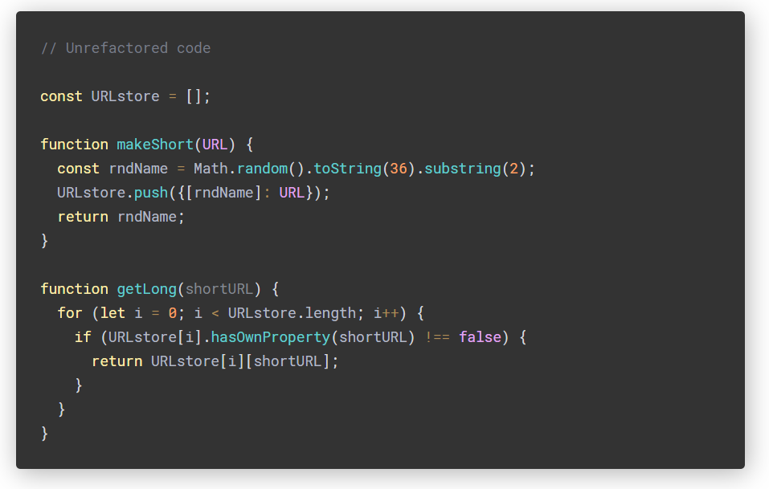
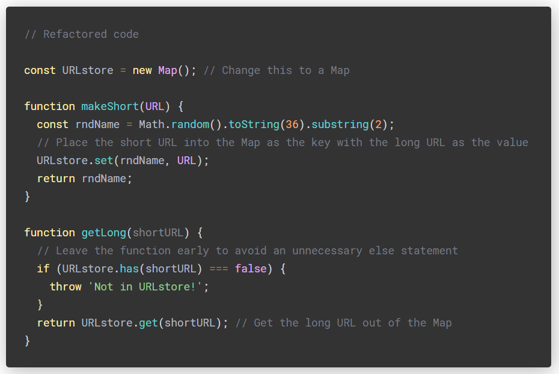
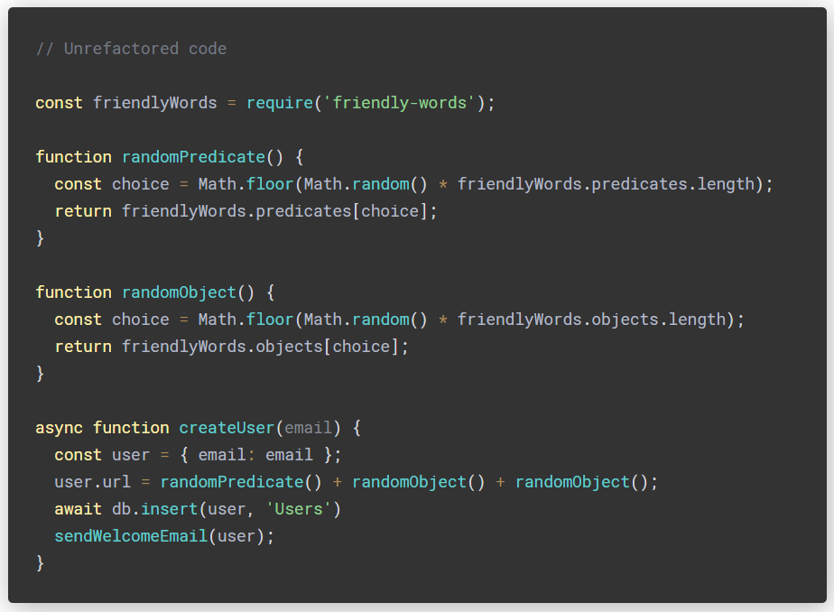
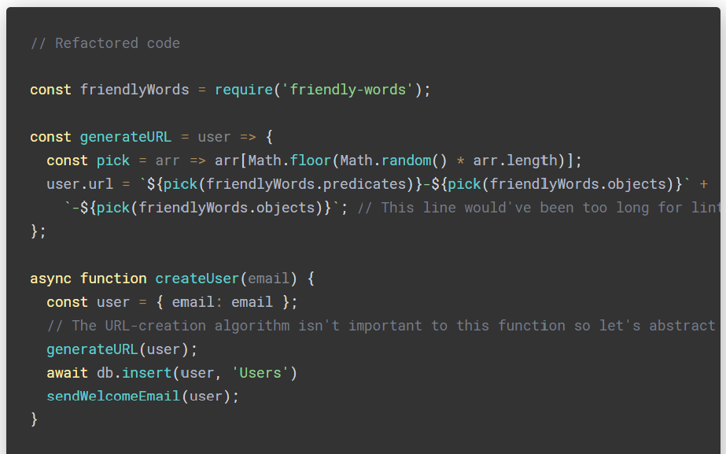
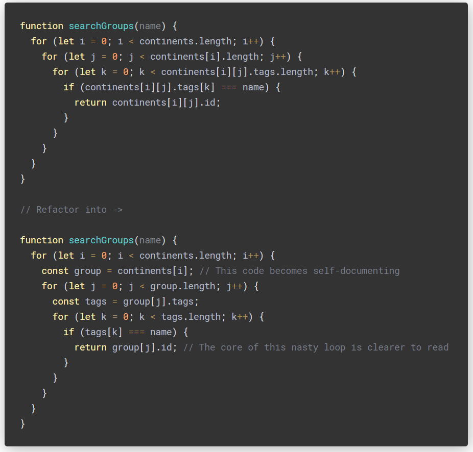
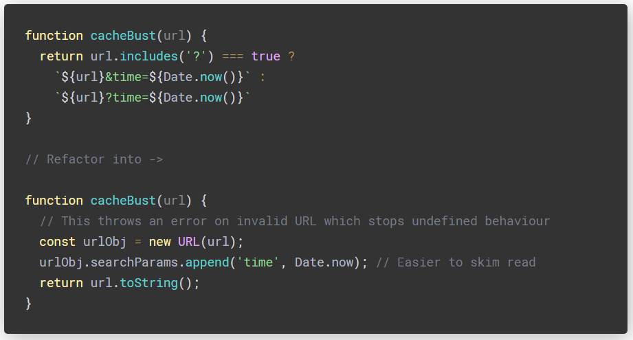

# Functional Programming Concepts

## What is Functional Programming?

Functional programming is a specific way to look at problems and model their solutions. Pragmatically, functional programming is a coding style that exhibits the following characteristics:

Power and flexibility. We can solve many general real-world problems using functional constructs
Simplicity. Most functional programs exhibit a small set of keywords and concise syntax for expressing concepts
Suitable for parallel processing. Via immutable values and operators, functional programs lend themselves to asynchronous and parallel processing.
In functional programming, programs are executed by evaluating expressions, in contrast with imperative programming where programs are composed of statements which change global state when executed. Functional programming typically avoids using mutable state. Everything is a mathematical function. Functional programming languages can have objects, but generally those objects are immutable -- either arguments or return values to functions. There are no for/next loops, as those imply state changes. Instead, that type of looping is performed with recursion and by passing functions as arguments.

## Why Functional Programming?

While you can develop concurrent, scalable and asynchronous software without embracing functional programming, it's simpler, safer, and easier to use the right tool for the job. Functional programming enables you to take advantage of multi-core systems, develop robust concurrent algorithms, parallelize compute-intensive algorithms, and to readily leverage the growing number of cloud computing platforms. Imagine you've implemented a large program in a purely functional way. All the data is properly threaded in and out of functions, and there are no truly destructive updates to speak of. Now pick the two lowest-level and most isolated functions in the entire codebase. They're used all over the place, but are never called from the same modules. Now make these dependent on each other: function A behaves differently depending on the number of times function B has been called and vice-versa.

# Refactoring JavaScript for Performance and 

## Scenario 1

We’re an URL-shortening website, like TinyURL. We accept a long URL and return a short URL that forwards visitors to the long URL. We have two functions.

Problem: what happens if getLong is called with a short URL that isn’t in the store? Nothing is explicitly returned so undefined will be returned

The answer is to use some form of hash function, which Maps and Sets use under the surface. A hash function is used to map a given key to a location in the hash table. Below, this happens when we place our short URL into the store in makeShort and when we get it back out in getLong. Depending on how you’re measuring run time, the result is that on average we only need to check one bucket — no matter how many total buckets there are!

For those examples, we assumed that the random function wouldn’t clash. ‘Cloning TinyURL’ is a common system design question and a very interesting one at that. What if the random function does clash? It’s easy to tack on addendums about scaling and redundancy.

## Scenario 2

We’re a social media website where user URLs are generated randomly. Instead of random gibberish, we’re going to use the friendly-words package that the Glitch team works on. They use this to generate the random names for your recently created projects!

It’s often said that a function should do one thing. Here, createUser does one thing .. kinda. It creates a user. However, if we’re thinking ahead to the future, there’s a good chance (if our business is successful) that this function is going to grow very large indeed. So let’s start early by breaking it up.

You may have also noticed that there is some duplicated logic in our random functions. The friendly-worlds package also offers lists for ‘teams’ and ‘collections’. We can’t go around writing functions for every option. Let’s write one function that accepts a list of friendly things.

We separated some logic and reduced the number of lines of code. We inlined a function called pick that accepts an array of length 1 and up and returns a random choice, then we used a template literal to build an URL.

## Strategies

Here are some straightforward to implement methods that can lead to easier to read code. There are no absolutes when it comes to clean code — there’s always an edge case!

Return early from functions:

Cache variables so functions can be read like sentences:

Check for Web APIs before implementing your own functionality:

It’s important to get your code right the first time because in many businesses there isn’t much value in refactoring. Or at least, it’s hard to convince stakeholders that eventually uncared for codebases will grind productivity to a halt.

