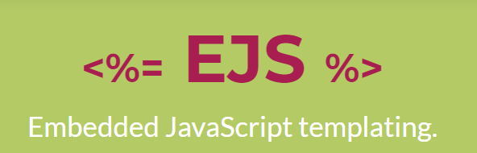

# EJS

## what's EJS?

EJS is a template system. You define HTML pages in the EJS syntax and you specify where various data will go in the page. Then, your app combines data with the template and "renders" 
 a complete HTML page where EJS takes your data and inserts it into the web page according to how you've defined the template.  
For example, you could have a table of dynamic data from a database and you want EJS to generate the table of data according to your display rules. It saves you from the drudgery of writing code to dynamically generate HTML based on data. 

## TAGS in EJS

* ``<%`` ‘Scriptlet’ tag, for control-flow, no output
* ``<%_`` ‘Whitespace Slurping’ Scriptlet tag, strips all whitespace before it
* ``<%=`` Outputs the value into the template (HTML escaped)
* ``<%-`` Outputs the unescaped value into the template
* ``<%#`` Comment tag, no execution, no output
* ``<%%`` Outputs a literal ‘<%’
* ``%>`` Plain ending tag
* ``-%>`` Trim-mode (‘newline slurp’) tag, trims following newline
* ``_%>`` ‘Whitespace Slurping’ ending tag, removes all whitespace after it

## to use EJS you need to:

- npm install ejs
- JS file ``let ejs = require('ejs');``

Now you can use it as a template. Feel the CLI a EJS file and enter layouts in that file.

