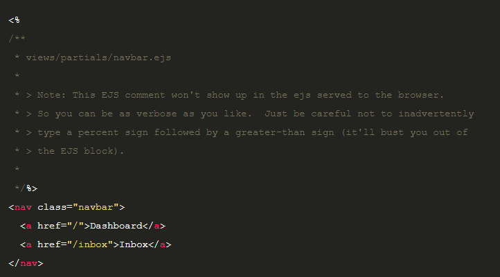
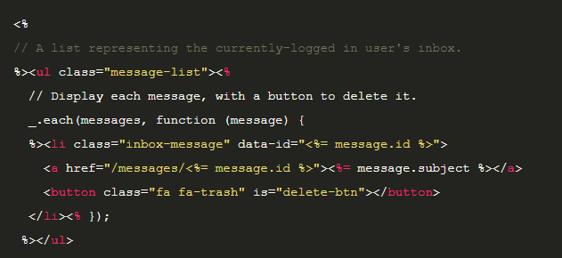

# EJS Partials

Partials come in handy when you want to reuse the same HTML across multiple views. Think of partials as functions, they make large websites easier to maintain as you don’t have to go and change a piece of text in every page it appears in. Instead, you define that reusable bundle of code in a file andinclude it wherever you need it.

When using the default view engine (ejs), Sails supports the use of partials (i.e. "view partials"). Partials are basically just views that are designed to be used from within other views.

They are particularly useful for reusing the same markup between different views, layouts, and even other partials.

```<%- partial('./partials/navbar.ejs') %>```

This should render the partial located at views/partials/navbar.ejs, which might look something like this:




The target path that you pass in as the first argument to partial() should be relative from the view, layout, or partial where you call it. So if you are calling partial() from within a view file located at views/pages/dashboard/user-profile.ejs, and want to load views/partials/widget.ejs then you would use:

```<%- partial('../../partials/navbar.ejs') %>```

## Overriding locals in a partial

Automatic inheritance of view locals takes care of most use cases for partials, but sometimes you might want to pass in additional, dynamic data. For example, imagine your app has duplicate copies of the following code in a few different views:



