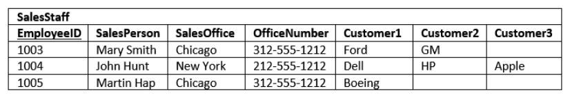

# Database Normalization

Database normalization is a process used to organize a database into tables and columns.  The main idea with this is that a table should be about a specific topic and only supporting topics included. Take a spreadsheet containing the information as an example, where the data contains salespeople and customers serving several purposes:

* Identify salespeople in your organization

* List all customers your company calls upon to sell a product

* Identify which salespeople call on specific customers.

By limiting a table to one purpose you reduce the number of duplicate data contained within your database. This eliminates some issues stemming from database modifications.

## Reasons for Database Normalization

There are three main reasons to normalize a database.  The first is to minimize duplicate data, the second is to minimize or avoid data modification issues, and the third is to simplify queries. 

As we go through the various states of normalization we’ll discuss how each form addresses these issues, but to start, let’s look at some data which hasn’t been normalized and discuss some potential pitfalls. 

I think once you understand the issues, you better appreciate normalization. Consider the following table:

The first thing to notice is this table serves many purposes including:

- Identifying the organization’s salespeople
- Listing the sales offices and phone numbers
- Associating a salesperson with an sales office
- Showing each salesperson’s customers

As a DBA this raises a red flag.  In general I like to see tables that have one purpose.  Having the table serve many purposes introduces many of the challenges; namely, data duplication, data update issues, and increased effort to query data.

## Data Duplication and Modification 

Notice that for each SalesPerson we have listed both the SalesOffice and OfficeNumber. There are duplicate salesperson data. Duplicated information presents two problems:

* It increases storage and decrease performance.
* It becomes more difficult to maintain data changes.

There are three modification anomalies that can occur:

* Insert Anomaly

* Update Anomaly

* Deletion Anomaly